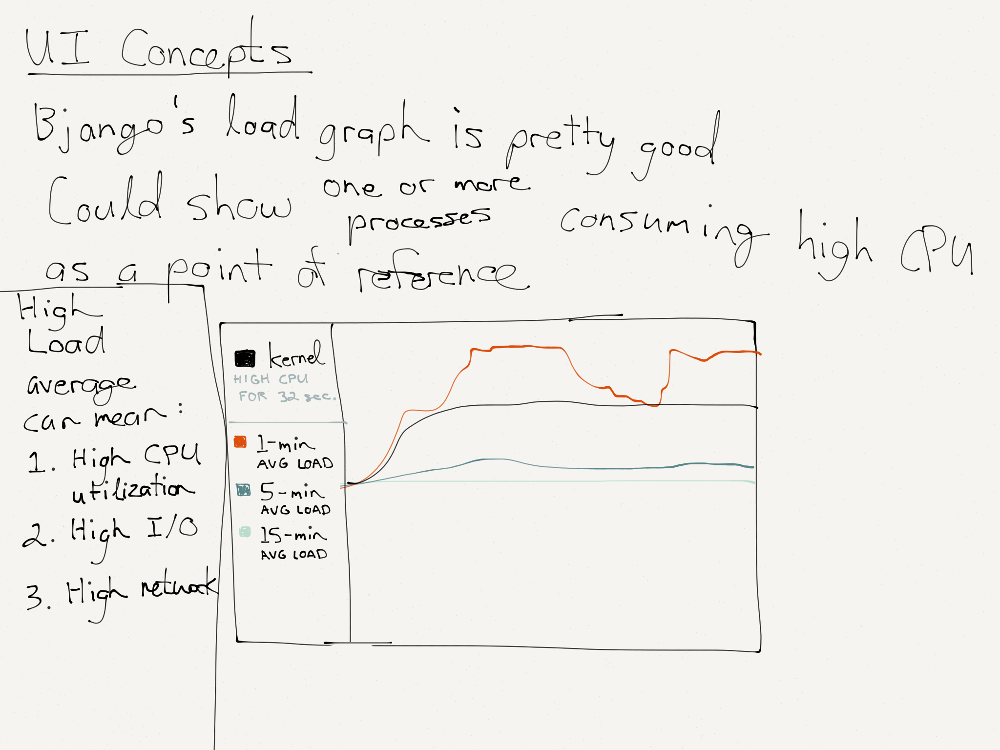
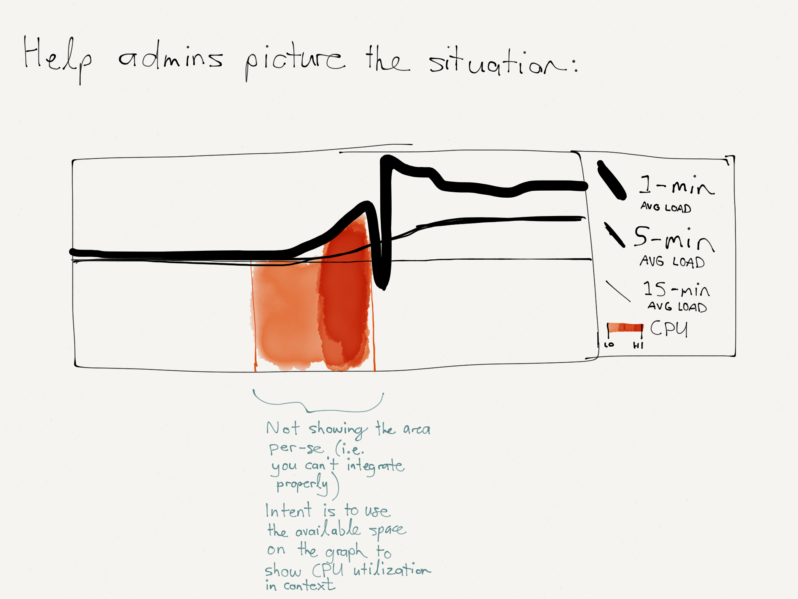
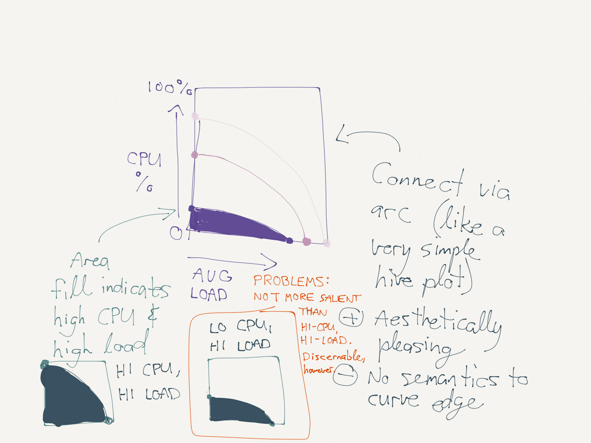
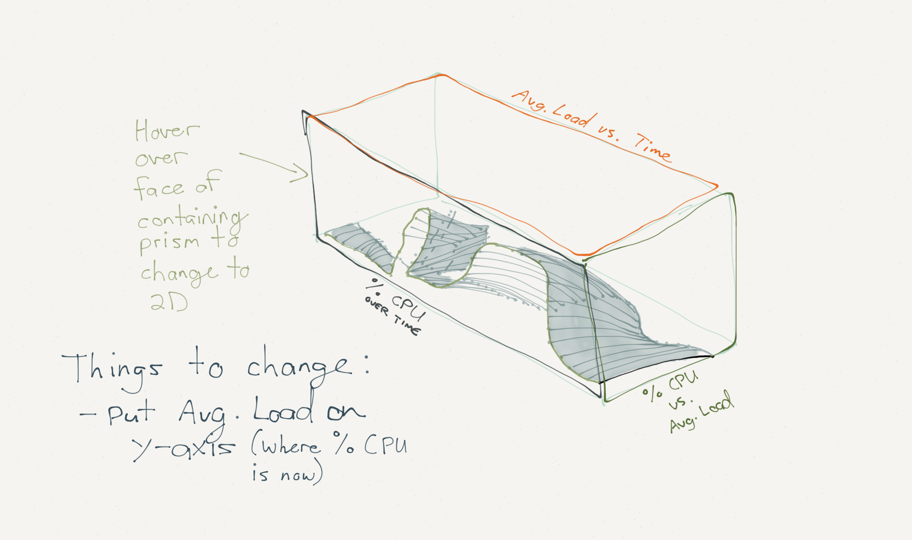
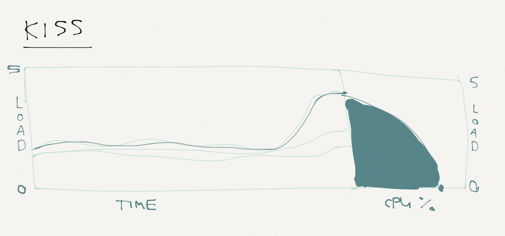

# Appendix

## Appendix A - Design Sketches

Sketches for an average load line graph, using [iStat Menus](http://bjango.com/mac/istatmenus/) as inspiration. Some early ideas include the possibility of encoding additional information, such as CPU utilization or top CPU-utilizing processes.

---- 

Sketches for a Load vs. CPU % area graph, based on the visual look of [Hive Plots](http://www.hiveplot.net).

---- 

An idea that never made it out of the sketch book: a 3D surface / area visualization of CPU usage and average load, with the Load vs. CPU area graph on the y-z plane of the containing volume. (This would have been very cool to build!)

---- 

A final doodle of a [“K.I.S.S.”](http://en.wikipedia.org/wiki/KISS_principle) version of the visualization, with the average load and Load vs. CPU % area graphs shown.

## Appendix B - Research Links

- `uptime` manpage entry on OS X 10.10.2
- `top` manpage entry on OS X 10.10.2
- [Load (computing) - Wikipedia, the free encyclopedia](http://en.wikipedia.org/wiki/Load_(computing))
- [Uptime V3 Is On The Way: Join The Beta! - Redo The Web](http://www.redotheweb.com/2012/11/16/uptime-v3-is-on-the-way-join-the-beta.html)
- [Uptime - Wikipedia, the free encyclopedia](http://en.wikipedia.org/wiki/Uptime)
- [WWDC 2013 Session Videos - Implementing OS X Push Notifications for Websites - Apple Developer](https://developer.apple.com/videos/wwdc/2013/?id=614 "WWDC 2013 Session Videos - Apple Developer")
- [Configuring Local Notifications - Safari Developer Library](https://developer.apple.com/library/safari/documentation/NetworkingInternet/Conceptual/NotificationProgrammingGuideForWebsites/LocalNotifications/LocalNotifications.html "Configuring Local Notifications")
- [Datadog Docs - Graphing Primer](http://docs.datadoghq.com/graphing/)
- [A Tour Through the Visualization Zoo - ACM Queue](https://queue.acm.org/detail.cfm?id=1805128)
- [Q–Q Plots](http://en.m.wikipedia.org/wiki/Q%E2%80%93Q_plot) and [P–P Plots](http://en.m.wikipedia.org/wiki/P%E2%80%93P_plot)
- [Common Static Visualization Types (Planar) - LibGuides at Duke University](http://guides.library.duke.edu/vis_types#planar)
- [Bjango’s iStat Menus for OS X](http://bjango.com/mac/istatmenus/)
- [Hive Plots](http://www.hiveplot.net) [(Specific Example)](http://www.hiveplot.net/img/assembly-quality.png)
- [psutil 2.2.1 : Python Package Index](https://pypi.python.org/pypi/psutil "psutil 2.2.1 : Python Package Index")
- [How to Scale SVG | CSS-Tricks](https://css-tricks.com/scale-svg/ "How to Scale SVG | CSS-Tricks")
- [D3.js Tips and Tricks: Filling an area under the graph](http://www.d3noob.org/2013/01/filling-area-under-graph.html "D3.js Tips and Tricks: Filling an area under the graph")
- [Line Chart](http://bl.ocks.org/mbostock/3883245 "Line Chart")
- [D3.js: run a transition continuously?](http://stackoverflow.com/a/17127850)
- [Notes on Animating Line Charts with d3 - Big elephants](http://big-elephants.com/2014-06/unrolling-line-charts-d3js/ "Notes on Animating Line Charts with d3 - Big elephants")
- [D3.js - Path Transitions](http://bost.ocks.org/mike/path/ "Path Transitions")
- [D3.js - Thinking with Joins](http://bost.ocks.org/mike/join/ "Thinking with Joins")
- [Pausing and Resuming D3-Transitions](http://xaedes.de/dev/transitions/ "Pausing and Resuming D3-Transitions")
- [Custom Tweens](http://bl.ocks.org/mbostock/3305854 "Custom Tweens")
- [click-to-zoom via transform](http://bl.ocks.org/mbostock/2206590 "click-to-zoom via transform")
- [Unclosed SVG path appears to be closed](http://stackoverflow.com/a/10213649)
- [How to update an svg path with d3.js](http://stackoverflow.com/a/22622385)
- [D3.js - Line Interpolation](http://bl.ocks.org/mbostock/3310323 "Line Interpolation")
- [D3.js Tips and Tricks: Adding grid lines to a d3.js graph](http://www.d3noob.org/2013/01/adding-grid-lines-to-d3js-graph.html "D3.js Tips and Tricks: Adding grid lines to a d3.js graph")
- [SVG Axes · mbostock/d3 Wiki](https://github.com/mbostock/d3/wiki/SVG-Axes "SVG Axes · mbostock/d3 Wiki")
- [D3.js - Spline Editor](http://bl.ocks.org/mbostock/4342190 "Spline Editor")
- [How to get local time from UTC using Moment.JS - DigiToffee : DigiToffee](http://www.digitoffee.com/programming/get-local-time-utc-using-moment-js/94/ "How to get local time from UTC using Moment.JS - DigiToffee : DigiToffee")

